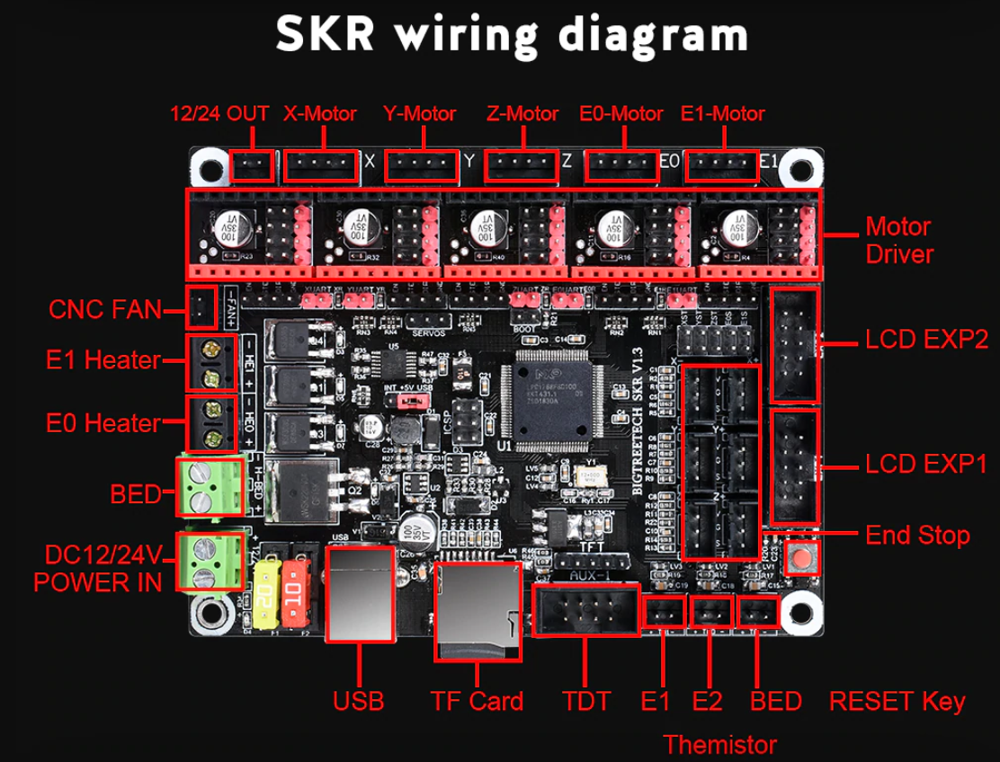

# SKR V1.3

 We discovered that this board expects the UART signal to be on pin 4 which apparently is what their 2130 steppers use. Other brands or types of steppers commonly use pin 5, including their own 2208 driver. In this case, you need to bridge the 4 and 5 pin together to be able to use UART mode. as shown here. 

SKR V1.3 Labeled

SKR V1.3 Pinouts



This is a case to fit the Ender 3 and Ender 3 Pro.



