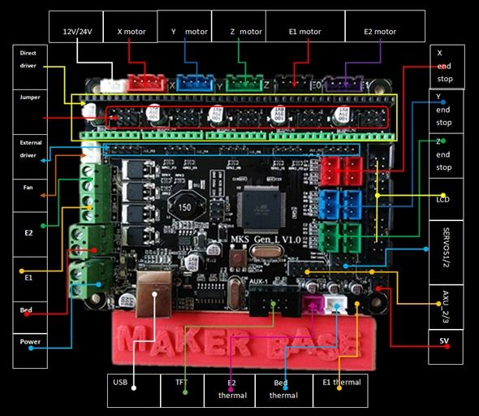
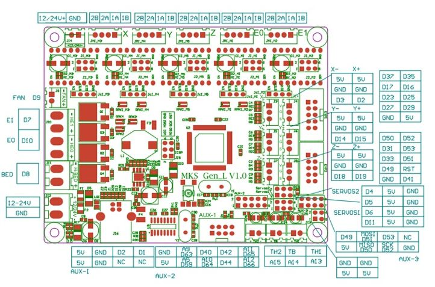

# MKS Gen L

If you are converting to a MKS Gen L, this video could be helpful It's aimed at Ender 3 Users and Marlin firmware, but trust me, it will still contain useful information. He also includes a 3d print for a custom case.



MKS Gen L Labeled

MKS Gen L Pinouts

TMC2208 wiring diagram for MKS Gen L You can skip the resistor pin and simply use one jumper instead. Klipper doesn't need it.

Example of connecting a End of Filament Sensor to the MKS Gen L ignore the printer name it's irrelevant.

Bl Touch wiring diagram

MKS Gen L Dimensions

This is a case designed by Michael at Teaching Tech for the Ender 3 and Ender 3 Pro



