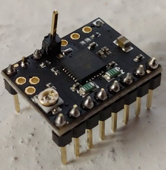
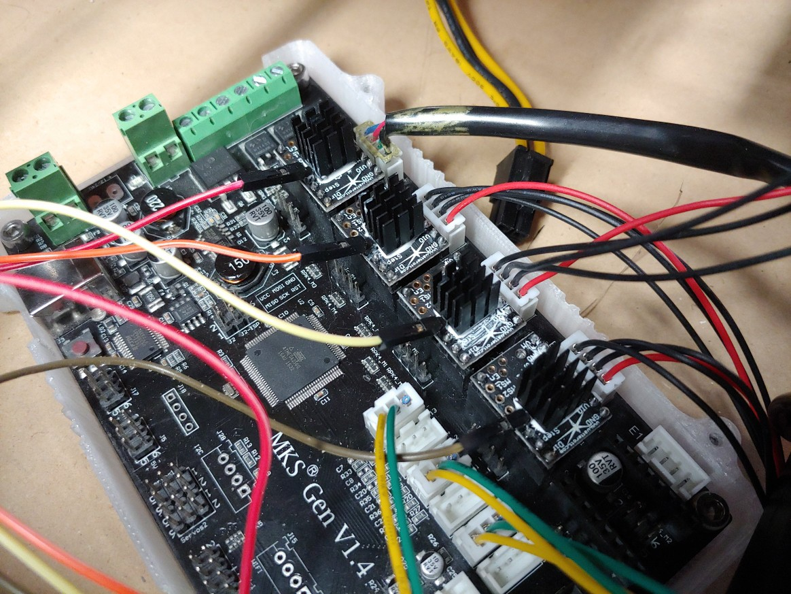
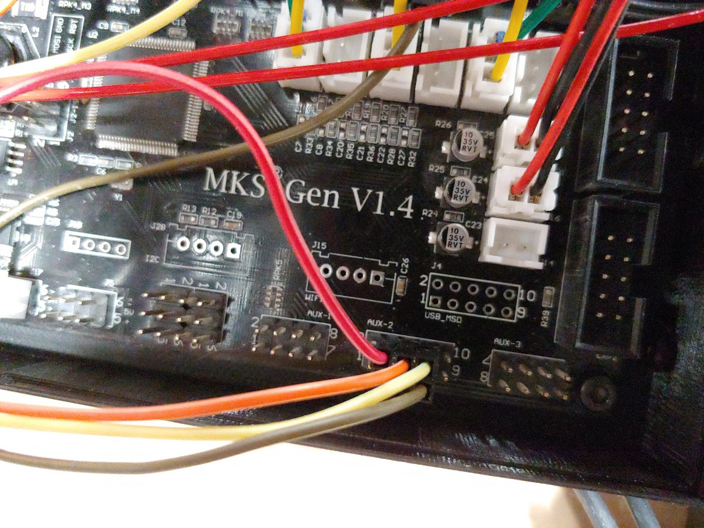
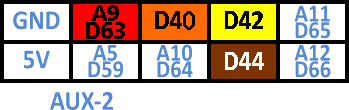

# MKS Gen V1.4 + TMC2208

Since this is a fairly common upgrade for Creality boards, and I dived into this exact upgrade path on my machine, I documented the process -- at the time mostly to make sure I did it right, but the result is that I can post rather simple pics that should help those looking to do this setup. I've done a bit of a write-up that goes before it

## **STILL LOOKING FOR TMC2208 DRIVERS?**

I simply cannot **HIGHLY** recommend enough buying five of them. Even if your machine will only require four \(X/Y/Z/E0\), buying a fifth \(E1\) will allow you to screw up once and not have any downtime, or even better, have a spare on hand. It is also **REQUIRED** that you purchase a version of the 2208's that supports UART in the first place. **NOT ALL TMC2208's ARE MADE ALIKE!!!**

### **Personal experience when buying**

I bought from DigiKey myself. It is genuine 100% Trinamic, from the chip to the board to the paired resistors and such, and not only is the version there always current, but the pins are not soldered on beforehand \(though they are included\), allowing you to solder one pin up for UART as you need to. Most of the ones on Amazon or AliExpress are pre-soldered, and they will work great for an SKR v1.3 where you only need to flip a few headers, or someone who has enough soldering finesse to work lose a breadboard pin from its slot and re-solder it upside-down. But unless you can find one that is UART-ready and has the relevant pin\(s\) sticking up, you might be better off soldering a fresh board. I found it far easier to make the jumper soldering job go well before I messed with the pins. Your mileage will vary, especially depending on soldering sill level.  
  
**NOTE:** if anyone knows of a pre-soldered UART TMC2208 that includes inverted pins, hit up @Shep on the Klipper Discord. Invite link is on the home page!

### How can I find a UART-compatible TMC2208?

There are a few ways to tell. The pins normally used for UART typically are labeled -- in fact for the most part they all are, but we are particularly focusing on the UART pins for this. If they are labeled "NC", that is short for "Not Connected" -- in other words UART _isn't even available._ So, ignore it and move to a different option. If it's blank, it's sketchy and could go either way. If it's labeled "U", "UART", or shows a weird gear logo \(which is actually the [Open Source Hardware](https://en.wikipedia.org/wiki/Open-source_hardware) logo since Trinamic open-sources the StepStick formats for their driver chips\), it is **probably** compatible. The best way to know depends on where you buy it from.  
  
DigiKey for example does support UART on the TMC2208 StepSticks, and says so in the datasheet, though it is buried deep in the seemingly thousands of pages of stuff not relevant to this small detail \(no I am not kidding, it is about a full bible in length -- Trinamic is _thorough_\).  
  
Amazon you can tell in one of two ways. If the seller states UART, they are obligated to be held to that standard. Confirm by looking at the screenshots to see what it says. Then search reviews for "UART" and see what the reviews say. Pay more attention to critical reviews than positive, but with a skeptical eyebrow and remember that not everyone is as well-informed as everyone else. Doing that however will give you a general consensus.  
  
AliExpress and other places, either it will say UART or you will simply have to ask the seller. Asking the seller **does not work on Amazon** because the seller and the fulfiller can be two entirely separate entities. The platform that hosts the sellers generally will bind sellers to their word, so they cannot mislead you on a product go get a sale. Meaning, if they say it has UART, it must have UART or you are entitled to a full refund no questions asked.

## Proper TMC2208 heatsinking

You will also want a version where the main TMC2208 IC \(or "chip"\) is on the bottom of the board, where a heatsink could be readily applied directly to the chip. Having the chip on the bottom is also correct orientation for proper heatsinking, and will prevent heat-related failures as well as ensuring that you can push well over a solid amp without any issues. Adding a heatsink to a 2208 chip directly on a driver that puts the chip on top **is still an acceptable approach**, you are only creating a new, bigger heatsink instead of tapping into the existing one and strengthening it.

### Brief technical explanation on the mechanics of the in-built heatsink vias

Each TMC2208 circuitboard design utilizes a grid of built-in "vias" that are placed directly underneath the TMC2208 chip. These "vias" are essentially electrically-conductive "tubes", which, due to the fact that they are nearly always copper, are highly thermally conductive too. Thus, when the TMC2208 gets hot, the vias get hot too. Since the copper on both sides of the board is connected, the heat transfers over to the opposite side of the board, where convection cooling whisks away some of the heat buildup, This helps to cool down the TMC2208. But, only marginally more than simply leaving it alone.  
  
However, it provides a rather nifty feature! By providing a highly thermally conductive channel on the opposite side of the board, a massive heatsink can be placed on the stepstick that can adhere to the circuitboard itself, on the opposite side of the one the chip resides on, cooling it off. However, heat is heat, and placing the heatsink directly on the chip -- even with the vias trying to pull some heat away -- will still act to cool it down. For the intents and purposes of 3D printing, **the only real difference between on-chip heatsinking and on-circuitboard heatsinking is structural.** On-chip can run the risk of bumping into the heatsink and damaging the chip. On-circuitboard runs a far lesser risk of this due to not being exposed to the chip. While it is true that there are more nuanced discussion points than that alone, you do not run into them sufficiently enough to waste time teaching about, it quickly leads to heavily diminished-to-zero returns.  
  
So if you look at any Trinamic driver, flip the board upside-down, and see a square-ish pattern of subtle dots, your eyes are not fooling you, you are seeing the vias at work! Each dot is a via, and inside of each via is a strand of copper, akin to an embedded wire. Neat!

## Assembly of TMC2208 for UART mode

Here's one of my TMC2208's that I assembled upside-down. The chip is on top as a result, and even worse, none of the pins match up. And to top it all off, even as a visual, the jumper is in the wrong position. But, some TMC2208's that have their chips on top can look like this, and it does at least still have the rest of the pins soldered correctly. So, here goes!



I **HIGHLY** recommend a right-angle header instead of a straight one for the UART pin. It will allow you to fit this within most cases without having to worry about vertical issues with the breadboard pins.  
  
Installed, the TMC2208's look like this:







| Axis | Color |
| :--- | :--- |
| X | Red |
| Y | Orange |
| Z | Yellow |
| E0 | Brown |

## Printer.cfg TEMPLATES


These are **ONLY** to get you mostly set up as far as pin assignment, these two config files were **NEVER INTENDED AS A RUNNABLE SHORTCUT**!!! Doing so can cause **IRREVERSIBLE HARDWARE DAMAGE** to your printer!!! Temperature sensor type, PID tuning, run current, velocity, acceleration, homing speeds, step distance, and max temps are all things that need to be confirmed before attempting to run your printer with this config. **WE ARE NOT LIABLE IF YOU DO NOT LISTEN TO THIS WARNING AND YOU DAMAGE HARDWARE!!!** The comment box located at the top of each file outlines the setup the file came from and issues with that setup and configuration.  
  
****It is **HIGHLY ADVISED** to set each TMC2208 "run\_current" section to what the motor is specified for if known, and when in doubt, aim low and work your way higher. Too many amps can fry your steppers, but too few will only be insufficient to turn it. Then, it is next advised to follow the [Config Checks document](https://github.com/KevinOConnor/klipper/blob/master/docs/Config_checks.md) on the Klipper GitHub page once you confirm everything looks as it should. Once your printer is starting to work a bit better, [calibrate Pressure Advance \("PA"\)](https://github.com/KevinOConnor/klipper/blob/master/docs/Pressure_Advance.md) for a good baseline. After that, start printing!



The commented-out section labeled "extruder 1" is currently unused, however the configuration is otherwise correct in its commented-out form. As per the warning above, take special care to adjust the temperature sensor type and run current as needed, as well as to select and utilize a UART pin. 





```yaml
# .-------------------------------------------.
# |    Klipper Discord's @Shep config for:    |
# |-------------------------------------------|
# | RigidBot Extreme Custom                   |
# | - OctoPrint                               |
# | - OEM MK7 extruder                        |
# | - OEM hot/cold end                        |
# | - 0.4mm SS nozzle for 1.75mm filament     |
# | - 600W 120v A/C Keenovo heated bed w/ SSR |
# | - MKS Gen v1.4 mainboard                  |
# | - 4 x TMC2208 with solo UART wire         |
# | - 1 x empty slot (unused second extruder) |
# | - Poorly balanced PID isues               |
# | - Unfixed velocity/acceleration issues    |
# | - NEVER PRESSURE ADVANCE TUNED (REQUIRED) |
# |-------------------------------------------|
# | !!! YOUR MILEAGE WILL ABSOLUTELY VARY !!! |
# | !!!! MAKE ADJUSTMENTS WHERE REQUIRED !!!! |
# '-------------------------------------------'

[stepper_x]
step_pin:              ar54
dir_pin:               !ar55
enable_pin:            !ar38
step_distance:         0.022406
endstop_pin:           ^!ar3
#endstop_pin:          ^!ar2
position_endstop:      0
position_max:          254
homing_speed:          50

[tmc2208 stepper_x]
uart_pin:              ar63
microsteps:            16
run_current:           1.0
stealthchop_threshold: 300

[stepper_y]
step_pin:              ar60
dir_pin:               !ar61
enable_pin:            !ar56
step_distance:         0.022406
endstop_pin:           ^!ar14
#endstop_pin:          ^!ar15
position_endstop:      0
position_max:          254
homing_speed:          50

[tmc2208 stepper_y]
uart_pin:              ar40
microsteps:            16
run_current:           1.0
stealthchop_threshold: 300

[stepper_z]
step_pin:              ar46
dir_pin:               ar48
enable_pin:            !ar62
step_distance:         0.000625
endstop_pin:           ^!ar18
#endstop_pin:          ^!ar19
position_endstop:      0.5
position_max:          254

[tmc2208 stepper_z]
uart_pin:              ar42
microsteps:            16
run_current:           1.0
stealthchop_threshold: 300

[extruder]
step_pin:              ar26
dir_pin:               !ar28
enable_pin:            !ar24
step_distance:         0.019094
nozzle_diameter:       0.400
filament_diameter:     1.750
heater_pin:            ar10
sensor_type:           EPCOS 100K B57560G104F
sensor_pin:            analog13
control:               pid
pid_Kp:                22.2
pid_Ki:                1.08
pid_Kd:                114
min_temp:              0
max_temp:              245

[tmc2208 extruder]
uart_pin:              ar44
microsteps:            16
run_current:           1.0
stealthchop_threshold: 300

#	[extruder1]
#	step_pin:              ar36
#	dir_pin:               ar34
#	enable_pin:            !ar30
#	heater_pin:            ar7
#	sensor_type:           EPCOS 100K B57560G104F
#	sensor_pin:            analog15
#	[...]
#
#	[tmc2208 extruder1]
#	uart_pin:              ???
#	microsteps:            16
#	run_current:           1.0
#	stealthchop_threshold: 300

[heater_bed]
heater_pin:            ar8
sensor_type:           EPCOS 100K B57560G104F
sensor_pin:            analog14
control:               pid
pid_Kp:                40.267
pid_Ki:                0.619
pid_Kd:                655.338
min_temp:              0
max_temp:              130

[fan]
pin:                   ar9

[mcu]
serial:                /dev/serial/by-id/usb-FTDI_FT232R_USB_UART_AI04OQND-if00-port0
baud:                  250000
pin_map:               arduino

[printer]
kinematics:            cartesian
max_velocity:          60
max_accel:             250
max_z_velocity:        10
max_z_accel:           100
```





```yaml
# .-------------------------------------------.
# |    Klipper Discord's @Shep config for:    |
# |-------------------------------------------|
# | RigidBot Extreme Custom                   |
# | - Duet Web Control                        |
# | - OEM MK7 extruder                        |
# | - OEM hot/cold end                        |
# | - 0.4mm SS nozzle for 1.75mm filament     |
# | - 600W 120v A/C Keenovo heated bed w/ SSR |
# | - MKS Gen v1.4 mainboard                  |
# | - 4 x TMC2208 with solo UART wire         |
# | - 1 x empty slot (unused second extruder) |
# | - Poorly balanced PID isues               |
# | - Unfixed velocity/acceleration issues    |
# | - NEVER PRESSURE ADVANCE TUNED (REQUIRED) |
# |-------------------------------------------|
# | !!! YOUR MILEAGE WILL ABSOLUTELY VARY !!! |
# | !!!! MAKE ADJUSTMENTS WHERE REQUIRED !!!! |
# '-------------------------------------------'

[stepper_x]
step_pin:              ar54
dir_pin:               !ar55
enable_pin:            !ar38
step_distance:         0.022406
endstop_pin:           ^!ar3
#endstop_pin:          ^!ar2
position_endstop:      0
position_max:          254
homing_speed:          50

[tmc2208 stepper_x]
uart_pin:              ar63
microsteps:            16
run_current:           1.0
stealthchop_threshold: 300

[stepper_y]
step_pin:              ar60
dir_pin:               !ar61
enable_pin:            !ar56
step_distance:         0.022406
endstop_pin:           ^!ar14
#endstop_pin:          ^!ar15
position_endstop:      0
position_max:          254
homing_speed:          50

[tmc2208 stepper_y]
uart_pin:              ar40
microsteps:            16
run_current:           1.0
stealthchop_threshold: 300

[stepper_z]
step_pin:              ar46
dir_pin:               ar48
enable_pin:            !ar62
step_distance:         0.000625
endstop_pin:           ^!ar18
#endstop_pin:          ^!ar19
position_endstop:      0.5
position_max:          254

[tmc2208 stepper_z]
uart_pin:              ar42
microsteps:            16
run_current:           1.0
stealthchop_threshold: 300

[extruder]
step_pin:              ar26
dir_pin:               !ar28
enable_pin:            !ar24
step_distance:         0.019094
nozzle_diameter:       0.400
filament_diameter:     1.750
heater_pin:            ar10
sensor_type:           EPCOS 100K B57560G104F
sensor_pin:            analog13
control:               pid
pid_Kp:                19.714
pid_Ki:                0.926
pid_Kd:                104.979
min_temp:              0
max_temp:              245

[tmc2208 extruder]
uart_pin:              ar44
microsteps:            16
run_current:           1.0
stealthchop_threshold: 0

#	[extruder1]
#	step_pin:              ar36
#	dir_pin:               ar34
#	enable_pin:            !ar30
#	heater_pin:            ar7
#	sensor_type:           EPCOS 100K B57560G104F
#	sensor_pin:            analog15
#	[...]
#
#	[tmc2208 extruder1]
#	uart_pin:              ???
#	microsteps:            16
#	run_current:           1.0
#	stealthchop_threshold: 300

[heater_bed]
heater_pin:            ar8
sensor_type:           EPCOS 100K B57560G104F
sensor_pin:            analog14
control:               pid
pid_Kp:                40.267
pid_Ki:                0.619
pid_Kd:                655.338
min_temp:              0
max_temp:              130

[fan]
pin:                   ar9

[mcu]
serial:                /dev/serial/by-id/usb-FTDI_FT232R_USB_UART_AI04OQND-if00-port0
baud:                  250000
pin_map:               arduino

[printer]
kinematics:            cartesian
max_velocity:          60
max_accel:             250
max_z_velocity:        10
max_z_accel:           100

[virtual_sdcard]
path:                  /home/pi/sdcard

[web_dwc2]
printer_name:          RigidBot
listen_adress:         0.0.0.0
listen_port:           4750
#listen_port:          80
web_path:              dwc2/web
```




Any comments or concerns, and please feel free to hit us up on our Discord!

